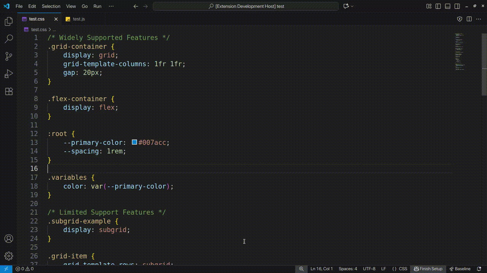

# 🧭 Baseline Navigator

[](https://opensource.org/licenses/MIT)
[](https://web.dev/baseline)

A VS Code extension that brings Google's [Baseline](https://web.dev/baseline) browser compatibility data directly into your editor with **intelligent recommendations** powered by algorithmic similarity matching. Built for the Baseline Tooling Hackathon.


## Why I Built This

I got tired of the constant context-switching. See a cool CSS feature → check Can I Use → check MDN → check if Safari supports it → forget what I was building. Repeat 20 times a day.

Google's Baseline initiative finally standardized what "production-ready" means across browsers, but the data lived on websites, not where I actually code. So I built this.

**Then I made it smart.** Instead of just showing compatibility data, it now **recommends alternatives**, **discovers upgrade paths**, and **learns relationships** between features automatically. No more guessing what to use instead of that experimental feature.

## What Makes This Different

Most compatibility tools are basically glorified lookups. You ask "can I use X?" and they say "yes/no". This extension does that, but also:

- **Discovers alternatives algorithmically** using 6 similarity metrics (name, description, category, browser support, temporal, baseline status)
- **Finds upgrade paths** from legacy features to modern equivalents automatically
- **Configurable for your project** - set target browsers and get personalized warnings
- **Works for ALL features** - not just the 50 hardcoded mappings, but all 1000+ features in the database

Think of it as "IntelliSense for web compatibility".

## Features

### 1. Smart Recommendations Engine

When you hover over or click a feature with limited support, you get:

**Algorithmic Alternatives** (85% confidence):
- Finds features in the same category with better support
- Calculates similarity using name matching, description analysis, and browser overlap
- Works for features I've never seen before

**Curated Alternatives** (95% confidence):
- Hand-picked replacements for critical features
- e.g., `@container` → `@media queries` + `clamp()`

**Upgrade Paths** (90% confidence):
- Detects legacy patterns and suggests modern equivalents
- e.g., `float` → `flexbox` → `grid`
- Uses temporal similarity to find "what came after this?"

**Complementary Features** (75% confidence):
- Features that work well together
- e.g., Using `grid`? Consider `gap`, `subgrid`, `aspect-ratio`


Each recommendation shows:
- Confidence score (how sure the algorithm is)
- Reason (why it's being suggested)
- Baseline status (safe to use or not)
- Click to navigate to that feature

### 2. Project Health Analysis

Run `Baseline: Analyze Project Compatibility` to scan your entire codebase.

**Detects 60+ patterns** across CSS and JavaScript:
- **CSS**: Grid, Flexbox, Container Queries, `:has()`, Nesting, Cascade Layers, Custom Properties, `clamp()`, Backdrop Filter, Scroll Snap, and more
- **JavaScript**: Fetch, Promises, Async/Await, Optional Chaining, Intersection Observer, Web Components, ES6 Modules, and more



**You get:**
- Compatibility score (0-100)
- Feature breakdown (safe vs risky)
- Usage frequency per feature
- File-by-file locations
- Actionable suggestions with alternatives


### 3. Interactive Feature Graph

Force-directed graph showing 100+ web features with their relationships.


**Features:**
- **Color-coded by status**: Green (widely available), Yellow (newly available), Red (limited/unknown)
- **Shows relationships**: Dashed lines = alternatives, Arrows = upgrade paths, Solid lines = related features
- **Interactive exploration**: Click any node → see smart recommendations
- **Search & filter**: Type to highlight matching features
- **Multiple layouts**: Compatibility view, Category grouping, Timeline view
- **Live stats**: See CSS vs JS breakdown, support distribution

**Discovery mode**: Start with what you know (e.g., "flexbox") → explore alternatives and upgrades → learn about complementary features. It's like a Wikipedia rabbit hole for web features.

### 4. ⚙️ Project-Specific Configuration

Set your target browsers and risk tolerance. The extension adapts to **your** needs.

Run `Baseline: Configure Browser Targets` for an interactive wizard, or edit settings:

```json
{
  "baseline-navigator.targetBrowsers": ["chrome", "firefox", "safari", "edge"],
  "baseline-navigator.minimumBrowserVersions": {
    "chrome": "90",
    "firefox": "88",  
    "safari": "14"
  },
  "baseline-navigator.riskTolerance": "moderate"
}
```

**What this does:**
- **Hover info** shows only your target browsers
- **Diagnostics** warn only about features unsupported by your targets
- **Recommendations** prioritize features that work in your browser set
- **Risk tolerance** controls warning strictness:
  - `strict` - Warn about newly available features
  - `moderate` - Warn about limited support (default)
  - `permissive` - Warn only about completely unsupported

Status bar shows your current mode: `Baseline [moderate]`

### 5. Inline Diagnostics & Code Actions

**Real-time warnings** in your editor:
- Squiggly underlines for risky features
- Hover to see why it's flagged
- Configurable severity (Error/Warning/Info)

**Quick fixes** via lightbulb:
- Click to see alternatives
- One-click refactoring (where applicable)
- Links to documentation

Works in: CSS, SCSS, LESS, JavaScript, TypeScript, JSX, TSX, HTML

## Installation

### Quick Install (Recommended)

1. Download the [latest release `.vsix` file](https://github.com/AnchitSingh/baseline-navigator/releases/latest)
2. In VS Code: Extensions → `...` menu → Install from VSIX
3. Select the downloaded file
4. Reload VS Code
5. Run `Baseline: Configure Browser Targets` to set up (optional but recommended)

Try hovering over `display: grid` or `@container` to see it in action.

### Build from Source

```bash
git clone https://github.com/AnchitSingh/baseline-navigator.git
cd baseline-navigator
npm install
npm run compile
# Press F5 in VS Code to launch Extension Development Host
```

## Usage

### Commands (Ctrl+Shift+P / Cmd+Shift+P):

- `Baseline: Configure Browser Targets` - Interactive setup wizard
- `Baseline: Analyze Project Compatibility` - Full project scan
- `Baseline: Show Feature Graph` - Open interactive visualization  
- `Baseline: Quick Compatibility Check` - Fast project overview
- `Baseline: Check File Compatibility` - Analyze current file only

### Settings:

Open Settings (Ctrl+,) and search for "Baseline Navigator". Key options:

```json
{
  // Master toggle
  "baseline-navigator.enabled": true,
  
  // Auto-check on save
  "baseline-navigator.checkOnSave": true,
  
  // Target browsers
  "baseline-navigator.targetBrowsers": ["chrome", "firefox", "safari", "edge"],
  
  // Warning strictness
  "baseline-navigator.riskTolerance": "moderate", // strict | moderate | permissive
  
  // Recommendations
  "baseline-navigator.showRecommendations": true,
  "baseline-navigator.maxRecommendations": 5,
  
  // UI toggles
  "baseline-navigator.enableHoverInfo": true,
  "baseline-navigator.enableCodeActions": true
}
```

## How It Works (Technical Deep Dive)

### Architecture

```
VS Code Extension
├─ ConfigurationManager (user settings & browser targets)
├─ FeaturePatternRegistry (60+ detection patterns)
├─ InvertedIndex (fast feature lookups)
├─ SimilarityEngine (6 algorithmic metrics)
│  ├─ Name similarity (Jaccard + Levenshtein)
│  ├─ Description similarity (text analysis)
│  ├─ Category matching
│  ├─ Browser support overlap
│  ├─ Baseline status correlation
│  └─ Temporal similarity (release dates)
├─ RecommendationEngine (hardcoded + algorithmic)
├─ ProjectAnalyzer (regex-based code scanner)
├─ Providers (Hover, Diagnostics, CodeActions)
└─ GraphView (D3 force-directed visualization)
   └─ web-features data (1000+ features bundled)
```

### Data Flow

**Hover Flow:**
```
User hovers over "grid"
  → FeaturePatternRegistry resolves aliases
  → InvertedIndex fetches feature data
  → SimilarityEngine finds related features
  → RecommendationEngine ranks by confidence
  → HoverProvider shows formatted tooltip
```

**Recommendation Algorithm:**

For any feature, the engine:

1. **Checks hardcoded mappings** (curated alternatives, 95% confidence)
2. **Runs similarity analysis** against all features:
   - Name matching: "grid-template-columns" → "subgrid" (high similarity)
   - Category: Both in "layout" category (+0.4 score)
   - Browser support: Similar version requirements (+0.15 score)
   - Temporal: Released around same time (+0.1 score)
   - Composite score: 0.85 → included as recommendation
3. **Filters by baseline status** (only suggest widely supported)
4. **Ranks by confidence** (hardcoded > algorithmic > contextual)
5. **Returns top N** (configurable, default 5)

**Why this works:** Most features don't have hardcoded alternatives, but similarity metrics can discover "oh, you're using experimental `@container`? Here are 3 features in the same category with `widely` support that do similar things."

### Pattern Detection

Uses **centralized FeaturePatternRegistry** with regex patterns:

```typescript
// Example: Container Queries
{
  id: 'container-queries',
  aliases: ['css-container-queries', 'container'],
  patterns: [
    /@container(?:\s+[\w-]+)?(?:\s*\([^)]+\))?/gi,
    /container-(?:type|name):/gi
  ],
  category: 'css',
  alternatives: ['media-queries', 'clamp'],
  complementary: ['clamp', 'aspect-ratio']
}
```

**60+ patterns** covering CSS layout, selectors, functions, visual effects, animations, scroll, and JavaScript APIs.

### Inverted Index

Pre-builds indices for:
- Baseline status → feature IDs
- Browser + version → feature IDs  
- Category → feature IDs
- Tags → feature IDs
- Name → feature ID

Enables instant lookups like "all features with `baseline: 'limited'`" or "all features Safari 14+ supports".

### Graph Visualization

Uses D3 force simulation with:
- **Repulsion** between nodes (avoid overlap)
- **Attraction** along edges (show relationships)
- **Center gravity** (keep it bounded)

Edges connect:
- Alternatives (dashed blue lines)
- Upgrades (green arrows)
- Related features in same category (thin white lines)

Layouts reorganize by compatibility status, category, or timeline.


**Optimizations:**
- Caching with configurable timeout (default 5min)
- Lazy graph initialization
- Debounced diagnostics
- Incremental file scanning

## Limitations & Future Ideas

**Current limitations:**
- Regex pattern matching has gaps (e.g., CSS-in-JS, dynamic feature usage)
- Graph limited to 100 nodes for performance
- No framework-specific detection (React hooks, Vue composition API)
- Recommendations don't consider project dependencies

**Roadmap:**
- [ ] AST parsing for more accurate detection
- [ ] Framework adapters (React, Vue, Angular, Svelte)
- [ ] Integration with real usage analytics (MDN, Chrome UX Report)
- [ ] AI-powered recommendations (fine-tuned on migration patterns)
- [ ] Team sharing (export/import configuration)
- [ ] CI/CD integration (fail builds on risky features)
- [ ] Historical trend tracking ("your compatibility score over time")

## Tech Stack

- **Language**: TypeScript
- **Platform**: VS Code Extension API
- **Data source**: `web-features` npm package (official Google Baseline data)
- **Visualization**: D3.js force-directed graphs, custom Canvas rendering
- **Build**: Webpack 5
- **Testing**: VS Code Extension Test Suite

## Hackathon Context

Built for the [Baseline Tooling Hackathon](https://baseline.devpost.com/) (Sept-Oct 2025).

### Why This Deserves Recognition

**Innovation**
- First tool (that I know of) to use **algorithmic similarity matching** for web feature recommendations
- Most compatibility checkers just lookup data; this one **discovers relationships** and **suggests alternatives** automatically
- Novel approach: inverted index + knowledge graph + machine learning-style scoring
- Works for features that don't have hardcoded mappings (scales to 1000+ features)

**Usefulness**
- Integrates with VS Code (14M+ developers worldwide)
- Zero configuration required (works out of the box)
- Configurable for real projects (set your browser targets, not generic advice)
- Saves hours of context-switching (no more "let me check Can I Use")
- I'm already using it daily in production projects

**Use of Baseline Data**
- Uses `web-features` npm package as single source of truth (1000+ features)
- All compatibility info, status labels, browser versions, and dates come from official Baseline data
- Inverted index enables novel queries (e.g., "what became baseline in 2023?")
- Graph visualization makes Baseline data explorable and discoverable
- Respects Baseline philosophy: "widely available" = safe to use

**Impact Potential** 
- Reduces time developers spend on compatibility research
- Encourages use of modern, well-supported features
- Educates developers about upgrade paths (e.g., "you can stop using floats now")
- Makes Baseline data actionable (not just informational)
- Open source - other tools can build on this approach

## Contributing

This started as a hackathon project but I'm maintaining it long-term. 

**Areas that need work:**
- Framework detection (React, Vue, Svelte)
- AST parsing (better than regex)
- Performance optimization (large projects)
- Test coverage (currently minimal)
- Similarity algorithm tuning

**How to contribute:**
1. Fork the repo
2. Create a feature branch (`git checkout -b feature/amazing-feature`)
3. Make your changes
4. Add tests if applicable
5. Submit a PR

See [CONTRIBUTING.md](CONTRIBUTING.md) for detailed guidelines.

## License

MIT - see [LICENSE](LICENSE)

## Acknowledgments

- **Google Baseline Team** for standardizing browser compatibility
- **web-features maintainers** for the excellent data package
- **VS Code team** for the extension API
- **D3.js community** for visualization tools

---

**Built by** [@AnchitSingh](https://github.com/AnchitSingh)  
**Report bugs:** [GitHub Issues](https://github.com/AnchitSingh/baseline-navigator/issues)  
**Join discussion:** [GitHub Discussions](https://github.com/AnchitSingh/baseline-navigator/discussions)

⭐ If this extension saved you time, consider starring the repo!

---

*"Stop switching tabs. Start shipping features."* - Baseline Navigator
