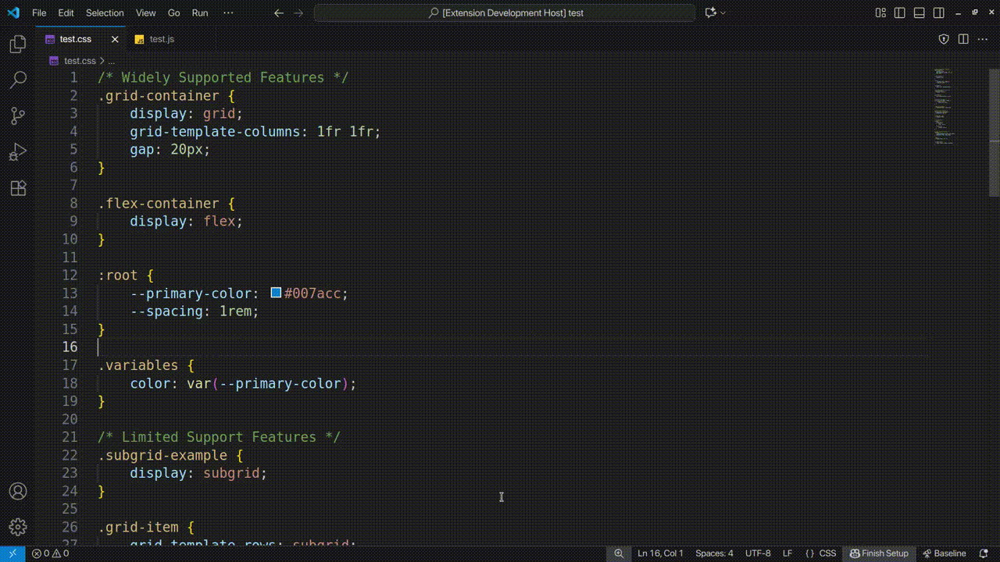

# 🧭 Baseline Navigator

[](https://opensource.org/licenses/MIT)
[](https://web.dev/baseline)

**Your intelligent co-pilot for modern web development.** Baseline Navigator brings real-time browser compatibility insights directly into VS Code, helping you build with confidence using the latest web features.


---

## The Problem

The web platform evolves rapidly. Developers face a constant dilemma: *Can I safely use this modern feature in production?* The answer requires checking multiple sources—MDN, Can I Use, release notes—fragmenting the development workflow and slowing down innovation.

**Google's [Baseline](https://web.dev/baseline)** solves this by providing clear, standardized compatibility status across major browsers. But developers need this information *where they work*—inside their editor, the moment they write code.

## Our Solution

**Baseline Navigator** bridges this gap with an intelligent VS Code extension that transforms how developers adopt modern web features. Instead of just warning about compatibility issues, it provides:

- **Real-time analysis** of your entire codebase
- **Actionable recommendations** for modernization
- **Visual exploration** through an interactive knowledge graph
- **Zero configuration** with offline-first architecture

Built for the [**Baseline Tooling Hackathon**](https://baseline.devpost.com/).

---

## Key Features

### **Project-Wide Compatibility Analysis**

Run a comprehensive scan to generate your **Compatibility Score**—an instant health check of how modern and cross-browser compatible your codebase is.

- Analyzes `.css`, `.scss`, `.js`, `.ts`, `.jsx`, `.tsx` files
- Counts feature usage across your entire project
- Categorizes features by Baseline status
- Generates detailed reports with actionable insights

### **Real-Time Diagnostics**

Baseline Navigator integrates seamlessly with VS Code's diagnostics engine:

- **Inline warnings** for features with limited or newly available support
- **Hover tooltips** with detailed Baseline status, browser versions, and availability dates
- **Severity levels** that respect your project's risk tolerance
- **No internet required**—all data bundled locally

### **Intelligent Recommendations**

More than a linter—it's your modernization assistant:

1. **Alternatives**: Suggests widely-supported replacements for risky features
   - Example: Recommends `@media` queries instead of experimental Container Queries
2. **Upgrades**: Identifies outdated patterns and proposes modern equivalents
   - Example: Detects `float` layouts and suggests upgrading to `flexbox` or `grid`

### **Interactive Knowledge Graph**

Visualize the web platform ecosystem in stunning detail:

- **Force-directed graph** with 100+ web features
- **Color-coded nodes** by Baseline status (Green = Widely Available, Yellow = Newly Available, Red = Limited)
- **Smart relationships** showing feature dependencies and alternatives
- **Click-to-explore** for discovering migration paths and related technologies
- **Filter by category, status, or timeline**

---

## How It Works

Baseline Navigator is engineered for **speed and accuracy**, built on a robust analysis pipeline:

### Architecture

```
┌─────────────────────────────────────────────────────────────┐
│                    VS Code Extension                        │
├─────────────────────────────────────────────────────────────┤
│  Extension Host  │  Inverted Index  │  Project Analyzer    │
│  (extension.ts)  │  (Fast Lookups)  │  (Regex Scanner)     │
├─────────────────────────────────────────────────────────────┤
│           Baseline Data (web-features NPM)                  │
│         1,000+ features -  Offline-first -  1.3MB             │
├─────────────────────────────────────────────────────────────┤
│  VS Code API  │  Webviews  │  Diagnostics  │  Hovers       │
└─────────────────────────────────────────────────────────────┘
```

### Processing Pipeline

1. **Data Source**: Uses official [`web-features`](https://www.npmjs.com/package/web-features) package as the single source of truth
2. **Inverted Index**: Builds an in-memory index on startup for sub-millisecond feature lookups
3. **File Scanner**: Analyzes workspace files using optimized regex patterns for CSS/JS feature detection
4. **Compatibility Engine**: Cross-references detected features with Baseline data to calculate scores
5. **Multi-Surface Integration**: Results surface through:
   - **Webviews** for interactive reports and graph visualization
   - **Diagnostics** for inline code warnings
   - **Hover Providers** for contextual information
   - **Code Actions** for quick-fix suggestions

### Innovation Highlights

- **Inverted search index** enables "What can I use with Chrome 90?" queries (not just "Can I use Grid?")
- **Knowledge graph visualization** reveals hidden relationships between web features
- **Dual recommendation system** covers both risk mitigation (alternatives) and modernization (upgrades)
- **Offline-first design** with zero API calls—works on planes, trains, and air-gapped networks

---

## Installation

### Build from Source

```
# Clone the repository
git clone https://github.com/AnchitSingh/baseline-navigator
cd baseline-navigator

# Install dependencies
npm install

# Compile TypeScript
npm run compile

# Launch in Extension Development Host
# Press F5 in VS Code, or:
code --extensionDevelopmentPath=$(pwd)
```

---

## 🎮 Usage

### Quick Start

1. **Open** a web project in VS Code
2. **Press** `Ctrl+Shift+P` (Windows/Linux) or `Cmd+Shift+P` (Mac)
3. **Run**: `Baseline: Analyze Project Compatibility`
4. **Explore** your compatibility score, feature breakdown, and recommendations

### Commands

| Command | Description |
|---------|-------------|
| `Baseline: Analyze Project Compatibility` | Run full codebase analysis and generate report |
| `Baseline: Show Feature Graph` | Open interactive knowledge graph visualization |
| `Baseline: Check File Compatibility` | Analyze current file only |

---

## 🎥 Demo

### Hover Tooltips


### Knowledge Graph


### Project Analysis Report


---

## 🏆 Hackathon Submission

This project was created for the **Baseline Tooling Hackathon** (September-October 2025).

### Judging Criteria Alignment

**Innovation**: 
- First tool to combine inverted index search with visual knowledge graphs
- Dual recommendation engine (alternatives + upgrades)
- Offline-first architecture for universal accessibility

**Usefulness**:
- Integrates with VS Code (14M+ developers)
- Works across CSS, JavaScript, TypeScript ecosystems
- Zero-config experience with immediate value

### Technical Stack

- **Language**: TypeScript
- **Platform**: VS Code Extension API
- **Data Source**: `web-features` NPM package (official Baseline data)
- **Visualization**: Force-graph library (D3-based)
- **Bundler**: Webpack


---

## 📜 License

This project is licensed under the **MIT License**. See [LICENSE](LICENSE) for details.
