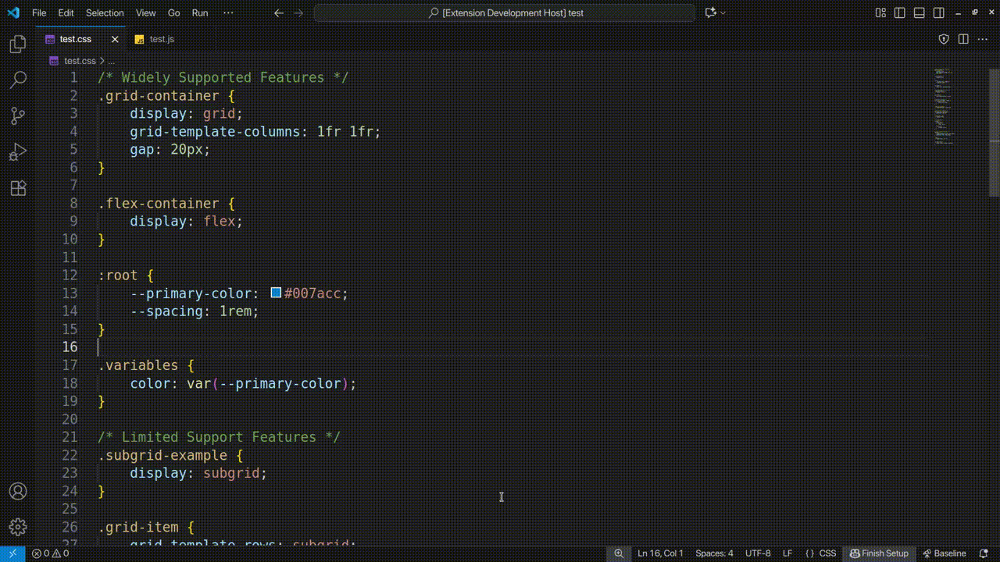

# 🧭 Baseline Navigator

[](https://opensource.org/licenses/MIT)
[](https://web.dev/baseline)

A VS Code extension that brings Google's [Baseline](https://web.dev/baseline) browser compatibility data directly into your editor. Built for the Baseline Tooling Hackathon.


## Why I Built This

I got tired of the constant context-switching. See a cool CSS feature → check Can I Use → check MDN → check if Safari supports it → forget what I was building. Repeat 20 times a day.

Google's Baseline initiative finally standardized what "production-ready" means across browsers, but the data lived on websites, not where I actually code. So I built this.

## What It Does

Three main things:

### 1. Real-Time Compatibility Info

Hover over any CSS/JS feature in your code → see Baseline status, browser support, when it became available. Works offline, no setup.


Also shows inline warnings for risky features before you ship them.

### 2. Project Health Scoring

Run `Baseline: Analyze Project Compatibility` to scan your whole codebase and get a compatibility score. 

Analyzes CSS, SCSS, JS, TS, JSX, TSX files and shows:
- Which features you're using and how often
- Your overall compatibility score
- Recommendations for safer alternatives or modern upgrades



The recommendation engine does two things:
- **Alternatives**: Suggests widely-supported replacements (e.g., use `@media` instead of experimental `@container`)
- **Upgrades**: Spots legacy patterns and suggests modern equivalents (e.g., `float` → `flexbox`)

### 3. Interactive Feature Graph

This started as "wouldn't it be cool to visualize all web features" and ended up being my favorite part.

Force-directed graph showing 100+ web features with:
- Color coding by Baseline status (green = widely available, yellow = newly available, red = limited)
- Relationships between features (alternatives, upgrade paths, dependencies)
- Click to explore and discover migration paths


Great for answering "what are my options for X?" or "how do I upgrade from Y?"

## Installation

### Quick Install (Recommended)

1. Download the [latest release `.vsix` file](https://github.com/AnchitSingh/baseline-navigator/releases/latest)
2. In VS Code: Extensions → `...` menu → Install from VSIX
3. Select the downloaded file
4. Reload VS Code

Try hovering over any CSS property to see it in action.

### Build from Source

```bash
git clone https://github.com/AnchitSingh/baseline-navigator.git
cd baseline-navigator
npm install
npm run compile
# Press F5 in VS Code to launch Extension Development Host
```

## Usage

**Commands** (Ctrl+Shift+P / Cmd+Shift+P):

- `Baseline: Analyze Project Compatibility` - Scan your whole codebase
- `Baseline: Show Feature Graph` - Open the visualization
- `Baseline: Check File Compatibility` - Analyze current file only

**Hover** over CSS properties or JS features to see compatibility info inline.

## How It Works

Uses the official [`web-features`](https://www.npmjs.com/package/web-features) npm package as the data source (1000+ features, 1.3MB, all bundled locally so it works offline).

The interesting technical bits:

**Inverted index** - Built an index that maps browser versions → features (not just features → browsers). This lets you query "what can I use with Chrome 90?" instantly.

**Regex-based scanner** - Analyzes your code with pattern matching to detect feature usage. Not perfect but fast enough for real-time feedback.

**Knowledge graph** - D3 force-directed layout that shows relationships between features. Turns compatibility data into something explorable.

**Dual recommendation system** - Finds safer alternatives AND modern upgrades using category/tag similarity matching.

```
VS Code Extension
├─ Hover Provider (tooltips)
├─ Diagnostics Provider (inline warnings)  
├─ InvertedIndex (fast lookups)
├─ ProjectAnalyzer (regex scanner)
├─ RecommendationEngine (alternatives/upgrades)
└─ GraphView (webview visualization)
   └─ web-features data (bundled)
```

## Known Issues / Future Ideas

- Regex approach has gaps - might miss features with unusual syntax
- Graph gets messy with 1000+ nodes, currently limited to 100 most common
- No framework-specific detection yet (React, Vue, etc.)
- Could use AST parsing instead of regex for better accuracy
- Would be cool to integrate with real analytics data ("X% of your users can't use this")

## Tech Stack

- TypeScript
- VS Code Extension API  
- `web-features` npm package (official Baseline data)
- `force-graph` library for visualization
- Webpack for bundling

## Hackathon Context

Built for the [Baseline Tooling Hackathon](https://baseline.devpost.com/) (Sept-Oct 2025).

**Why this matters for the judging criteria:**

*Innovation* - First tool (that I know of) to combine inverted index search with visual knowledge graphs. Most compatibility tools just do lookups; this shows relationships and suggests alternatives.

*Usefulness* - Works with VS Code (14M+ developers), covers CSS/JS/TS, zero config. Already using it daily myself and it's saved me countless Can I Use tabs.

*Use of Baseline data* - Uses `web-features` package as single source of truth. All compatibility info, status labels, and browser versions come directly from official Baseline data.

## License

MIT - see [LICENSE](LICENSE)

---

**Contributing**: This was a hackathon project but I'm planning to maintain it. Issues and PRs welcome! Areas that need work: framework detection, AST parsing, performance optimization.

Built by [@AnchitSingh](https://github.com/AnchitSingh) | [Report Bug](https://github.com/AnchitSingh/baseline-navigator/issues)
